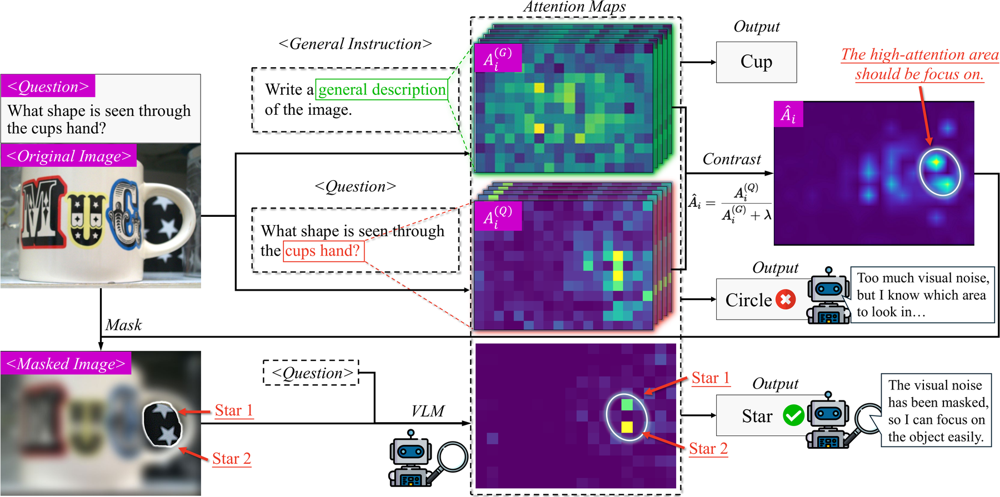

# [ECCV 2026] CARVE: Contrastive Attention Refinement for Visual Enhancement

[](https://arxiv.org/abs/2509.06461)
[](https://arxiv.org/pdf/2509.06461)
[](https://geyuyao.com/carve/)
[](https://huggingface.co/papers/2509.06461)
[]()

CARVE is a **training-free** method that contrasts the attention of a task question against a general instruction to suppress visual noise, then masks / crops / magnifies the task-relevant region and re-queries the VLM — no fine-tuning, no external detectors.

## 📣 News
- **[Jul 2026]** Our paper has been accepted to **ECCV 2026**! 🎉
- **[Sep 2025]** Paper and code released ([arXiv:2509.06461](https://arxiv.org/abs/2509.06461)).

## Contents
- [Key ideas](#key-ideas)
- [Repo layout](#repo-layout)
- [Quick start](#quick-start)
  - [1. Install](#1-install)
  - [2. Run](#2-run)
  - [3. Use as a library](#3-use-as-a-library)
- [Citation](#citation)
- [Acknowledgements](#acknowledgements)

## Key ideas

<p align="center">
  
</p>

- **Visual complexity disperses attention.** Complex scenes (rich textures/colors) raise attention entropy and hurt VLM reasoning; attention refines from global scanning in shallow layers to focused convergence in deep layers.
- **Contrastive attention.** A *general* instruction (e.g. “Write a general description of the image.”) mostly captures image-inherent visual noise, while a *task* question adds semantic focus. Contrasting the two attention maps ($A^{(Q)}/(A^{(G)}+\lambda)$) isolates the task-relevant semantic signal.
- **Pixel-level refinement.** The contrasted attention is fused across layers/steps, thresholded into connected regions, and used to mask / crop / magnify the input before a final re-query — a 3-pass, plug-and-play pipeline.

## Repo layout
```
carve/
  attention.py   # generation-time attention capture + contrast + layer/time fusion
  masking.py     # connected-component region selection -> mask -> crop -> magnify
  pipeline.py    # 3-pass CARVE inference + model loading (Qwen2.5-VL / LLaVA-1.5)
  visualize.py   # pipeline / layer-wise figures (used by --plot)
main.py          # entry point
launch.sh        # launcher
```

## Quick start

### 1. Install
```bash
pip install -r requirements.txt
```

### 2. Run
```bash
# IMAGE=/path/to/image.jpg QUESTION="your question" \
#   bash launch.sh [MODEL_ID] [FAMILY] [VERSION]
IMAGE=/path/to/image.jpg QUESTION="your question" \
  bash launch.sh Qwen/Qwen2.5-VL-3B-Instruct qwen2_5 v4
```
or directly:
```bash
python main.py --model-id Qwen/Qwen2.5-VL-3B-Instruct --family qwen2_5 \
    --image /path/to/image.jpg --question "your question" \
    --version v4 --save-dir outputs
```
`--version` selects the method variant (`v1`-`v4`). With `--save-dir`, the intermediates (`sum_att_map.png`, `mask_map.png`, `masked_image.png`, `crop_masked_image.png`, `marked_original.png`) are written for inspection. Add `--plot` to also save `pipeline.png` (original | attention | mask | refined) and `layerwise.png` (per-layer contrastive attention).

### 3. Use as a library
```python
from PIL import Image
from carve import carve, load_model

model, processor = load_model("Qwen/Qwen2.5-VL-3B-Instruct", family="qwen2_5")
out = carve(model, processor, Image.open("/path/to/image.jpg"),
            "your question", family="qwen2_5", version="v4")

print(out.original_answer)   # answer on the raw image
print(out.refined_answer)    # answer after contrastive refinement
```

## Citation
```bibtex
@inproceedings{ge2026focusing,
  title={Focusing by Contrastive Attention: Enhancing VLMs' Visual Reasoning},
  author={Ge, Yuyao and Liu, Shenghua and Wang, Yiwei and Mei, Lingrui and Bi, Baolong and Zhou, Xuanshan and Yao, Jiayu and Guo, Jiafeng and Cheng, Xueqi},
  booktitle={European Conference on Computer Vision (ECCV)},
  year={2026}
}
```

## Acknowledgements
This work builds on [**ViCrop**](https://github.com/saccharomycetes/mllms_know).
